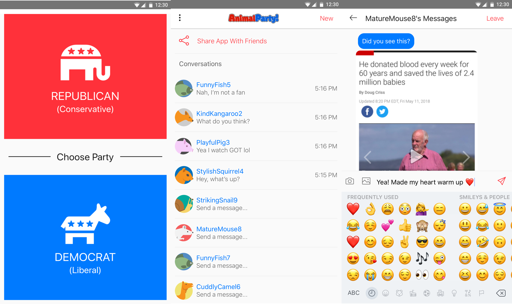

# Animal Party!
Animal Party! is a chat app that connects members of opposite U.S. political parties.

* Choose your political leaning: Democrat or Republican
* Get paired with someone from the opposite party
* Message each other in an anonymous, one-on-one chat room
* Leave conversations or join other ones whenever you want

Animal Party! was developed for Android & iOS in 2018 by Anshuman Dewangan and Vinit Parikh. The code is free for everyone to view, reuse, and evolve. If you do use the code in your own projects, attribution to Anshuman & Vinit would be appreciated. 



# animalparty-api
Repository for Animal Party's back-end using Ruby on Rails. **Also see [animalparty-mobile](https://github.com/anshuman64/animalparty-mobile).**

## Setup
1. Open .bash_profile (create the file if it does not exist).
````
open ~/.bash_profile
````
Add the following lines:
````
export ANIMALPARTY_ONE_SIGNAL_APP_ID="Ask anshuman64 for the key"
export ANIMALPARTY_ONE_SIGNAL_AUTH_KEY="Ask anshuman64 for the key"
export ANIMALPARTY_PUSHER_APP_ID="Ask anshuman64 for the key"
export ANIMALPARTY_PUSHER_KEY="Ask anshuman64 for the key"
export ANIMALPARTY_PUSHER_SECRET="Ask anshuman64 for the key"
````

## Release
### Quick Release
0. Uncomment all "Debug Test" code (ie. OneSignal push notifications)!
1. Make sure all code is COMMITTED to current branch
1. Run command:
````
eb deploy animalparty-production-server
````

### Full Release
0. Uncomment all "Debug Test" code (OneSignal push notifications)!
1. Log into AWS Console: https://console.aws.amazon.com/
2. Click "Services" > "Compute" > "Elastic Beanstalk"
3. Click "animalparty-production-server-1" or "animalparty-production-server-2"
4. Click "Actions" > "Clone Environment"
5. Change "Environment name" to the opposite of the existing environment (1 vs. 2) and click "Clone"
6. Wait for environment to build...
7. Make sure all code is COMMITTED to current branch (or else it gives a warning)
8. Run command:
````
eb deploy animalparty-production-server-1
````
9. Wait for environment to update in AWS Console...
10. On Elastic Beanstalk application page, click "Actions" > "Swap Environment URLs"
11. Click "Okay"
12. Done! Production API calls will now be routed to the new, updated environment
